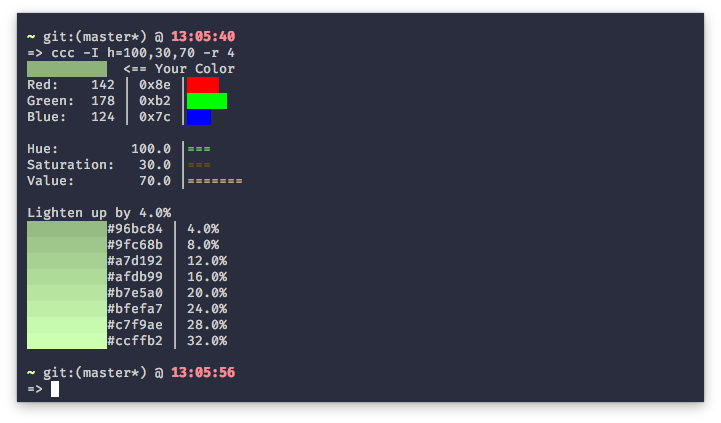
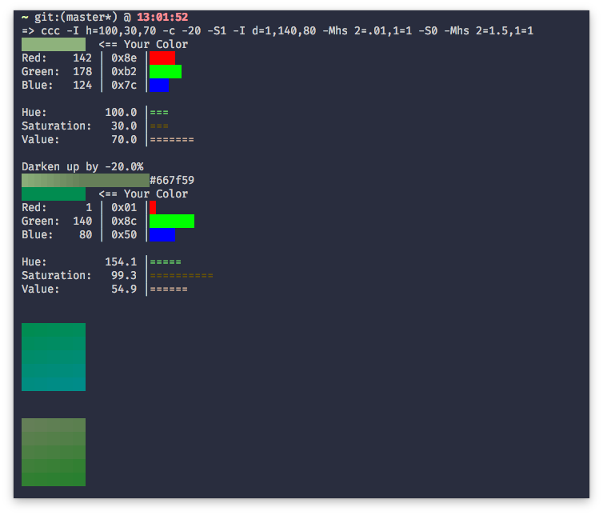

# Color Code Converter
    
    Program to Convert/Show Color Code
    
    - Format: rgb, hex, hsv
    - Make Color Lighter
    - Make Color Darker

## How to use
#### NOTE: You Need a Terminal which supports Direct/True Color

```
git clone https://github.com/zakarouf/colorcodeconverter
cd colorcodeconverter
./compile
./ccc -h
```

### Arguments
1. `-I [d,x,h]`
    Will take a value in `d`Comma Seperated RGB `x`Hexadecimal `h`Comma Seperated HSV. And then thow the details.
    Example:-
    `./ccc -I x=90a355`
    `./ccc -I d=12,34,100`

2. `-c`
    Will Brighten the given color by a given percentage.
    Example:-
    `./ccc -Ix 09117d -c 4` <= Will Brigten it up by 4%.

    Some Variation of `-c` are:
        `-v` Shows a Smooth Line
        `-r` Execute `-c` Multiple times


## Screenshots




